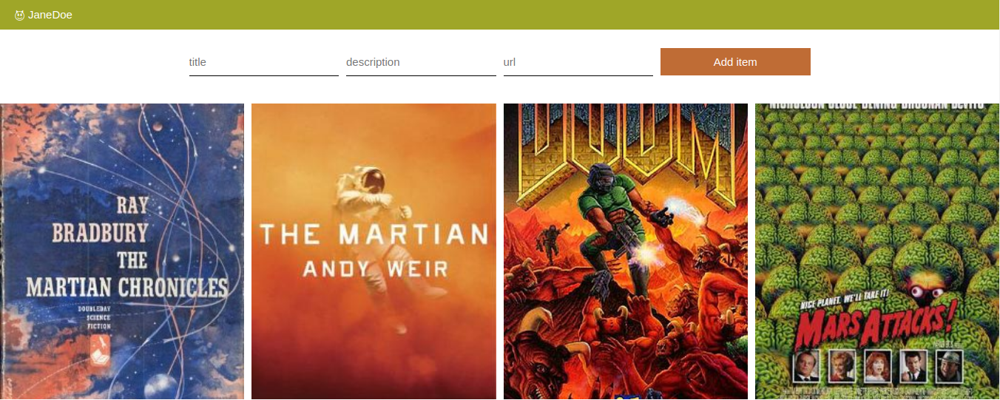

# Martian-library


## Description
GraphQL introduction tutorial from EvilMartians team.  
Tutorial consist of three parts:
- [From zero to the first query](https://evilmartians.com/chronicles/graphql-on-rails-1-from-zero-to-the-first-query) — setting up a project, adding first queries to both back-end and front-end applications. :heavy_check_mark:
- [Updating the data](https://evilmartians.com/chronicles/graphql-on-rails-2-updating-the-data) — adding mutations. :heavy_check_mark:
- [On the way to perfection](https://evilmartians.com/chronicles/graphql-on-rails-3-on-the-way-to-perfection) — adding subscriptions, and some refactoring. :heavy_check_mark:

### How to run

You need `docker` and `docker-compose` installed (for MacOS just use [official app](https://docs.docker.com/engine/installation/mac/)).

```sh
$ docker-compose up -d
$ docker-compose run app rails db:create db:migrate db:seed
```

It builds the Docker images, installs Ruby and NodeJS dependencies, creates database, run migrations and seeds.
